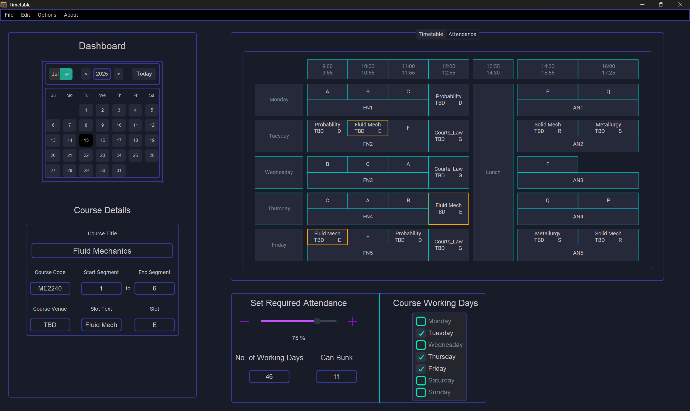
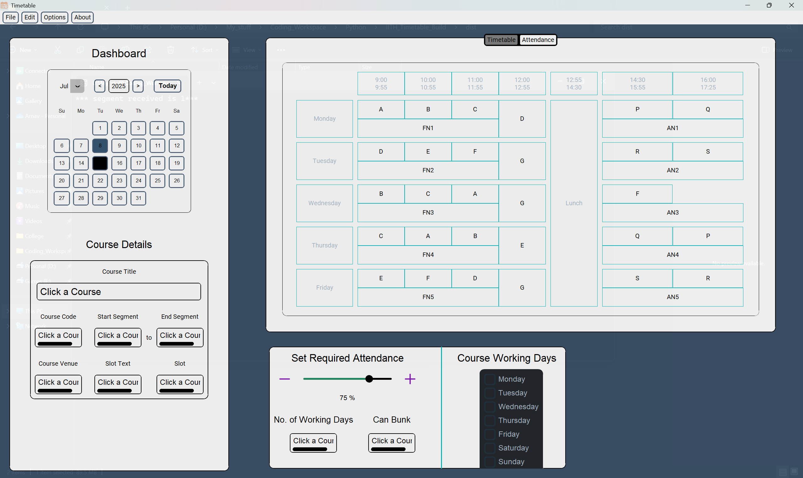
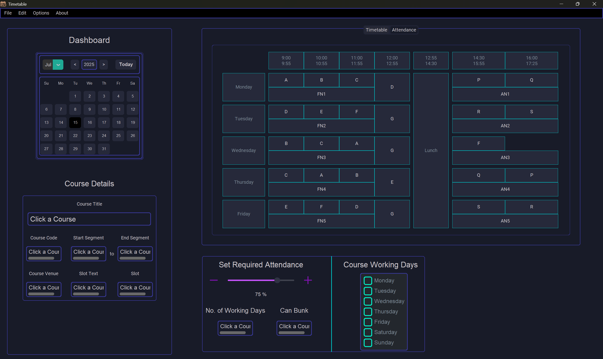

# Timetable

Efficiently manage your course schedule at IITH with a smart timetable app that automatically adapts to the fractal segment system, parses your academic calendar, tracks working days, plans for minimum attendance, and lets you export to your favorite calendar service.



## Table of Contents

- [Features](#features)
- [How It Works](#how-it-works)
- [PDF Calendar Parsing](#pdf-calendar-parsing)
- [Holiday and Working Day Calculation](#holiday-and-working-day-calculation)
- [Attendance \& Bunk Calculator](#attendance--bunk-calculator)
- [iCalendar Export](#icalendar-export)
- [Customize UI](#customize-ui)
- [Installation](#installation)
- [Reporting Issues](#issues)


## Features

- Supports the unique IITH fractal segment timetable system.
- Reads the official academic calendar PDF and extracts:
    - Segment start \& end dates.
    - All holidays (including semester breaks and public holidays).
- Dynamically tracks number of working days per segment.
- Calculates allowed "bunk" days based on your custom attendance percentage setting.
- Exports all course events as an `.ics` iCalendar file, uploadable to Google Calendar and others.


## How It Works

1. **Upload your academic calendar PDF.**
2. **Add courses and respective details**
3. The app detects your current courses and year’s segment structure.
4. It carries out the following:
    - Determines all teaching segments, start and end dates.
    - Parses holidays and academic breaks.
    - Calculates required attendance and how many classes you can miss.
    - Generates a complete timetable, which you can export and sync with your preferred calendar app.

## Adding Courses
1. Add courses via Edit>Edit Courses
2. Give information as required
3. **Do not leave any field empty, fill in TBD or anything within the character limit, if its not known**


## PDF Calendar Parsing

- Uses robust PDF parsing to extract all important dates from the IITH academic calendar.
- Finds all:
    - Segment start and end dates.
    - Institute holidays.
    - Exam breaks and special academic events.

### Operation

- Get pdf file from [IITH Academic Website](https://iith.ac.in/academics/calendars-timetables/)
- Upload it to the app via Edit>Upload Academic Timetable
- Confirmation window pops up after reading the file.

<br><br>

- Edit dates if necessary
- **Can be manually corrected later via Edit>Edit Segments and Edit>Edit Holidays**


## Holiday and Working Day Calculation

- Automatically builds a list of holidays from the uploaded pdf file
- Calculates working days for each semester

### Operation
- Segments can be manually corrected via Edit>Edit Segments

- Holidays can be manually corrected via Edit>Edit Holidays


## Attendance \& Bunk Calculator

- Set your custom minimum attendance percentage (e.g., 75%).
- For each course, calculates:
    - Total required classes for given attendance criteria.
    - Maximum classes you may miss (“bunk”) while meeting your attendance target.
- Visual overview helps you plan responsibly and avoid attendance shortages.


## iCalendar Export

- Exports your personalized timetable in `.ics` iCalendar format.
- Supported by Google Calendar, Microsoft Outlook, macOS Calendar, and most mobile calendar apps.
- All lectures, labs, holidays, and events included—simply import for automatic scheduling.

### Operation
- Export via File->Export
- Your output file will be named `cal.ics`, the directory will be printed in the terminal.

## Customize UI
- Change theme via Options>Change Theme
- Existing themes include
    - **Default**
    
    - **Printable**
    
    - **Sweetkind**
    
- Adjust transparency via Options>Adjust Transparency

If you want to create a new theme, I highly recommend using [ctk_theme_builder](https://github.com/avalon60/ctk_theme_builder). Create a theme and post it on the [Discussions Forum](https://github.com/D1gita7Duck/IITH-timetable/discussions) with the *enhancement* label. I will add it if and when possible.

*More themes on the way*

## Installation

### Requirements

- Compatible with Windows only


### Steps

1. **Download the executable file from the [releases page](https://github.com/D1gita7Duck/IITH-timetable/releases)**

*It is recommended to put the `.exe` file in a suitable folder, as other files will be created on running the application.*

2. **Run the application:**
Double click on `IITH_Timetable.exe` or use the method specified in the [Issues section](#issues).

3. **Access via Windows Start Menu** *(optional)*:
If you want to access the app from the Windows Start Menu (pressing the Windows key), create a shortcut of the `.exe` and move it to the following location
`C:\ProgramData\Microsoft\Windows\Start Menu\Programs`

### Notes

- Make sure you have a valid IITH academic calendar PDF file from the correct source as given in [PDF Calendar Parsing>Operation](#operation).
- For exporting to iCalendar, your output file will be named `cal.ics`, the directory will be printed in the terminal.
- For any issues, please check the [Issues section](#issues) to report it or search for existing ones at the [Issues page](https://github.com/D1gita7Duck/IITH-timetable/issues)

## Issues
If you face any error or problem, please follow the steps given below to reproduce and report it:
1. Navigate to the folder in which the `IITH_Timetable.exe` exists
2. Right click in the File Explorer and choose Open in Terminal
3. Run
```sh
./IITH_Timetable.exe
```
4. Do the series of tasks that led to the error.
5. Copy the error and stack trace and post it on the [Issues page](https://github.com/D1gita7Duck/IITH-timetable/issues)

*Happy scheduling!*

